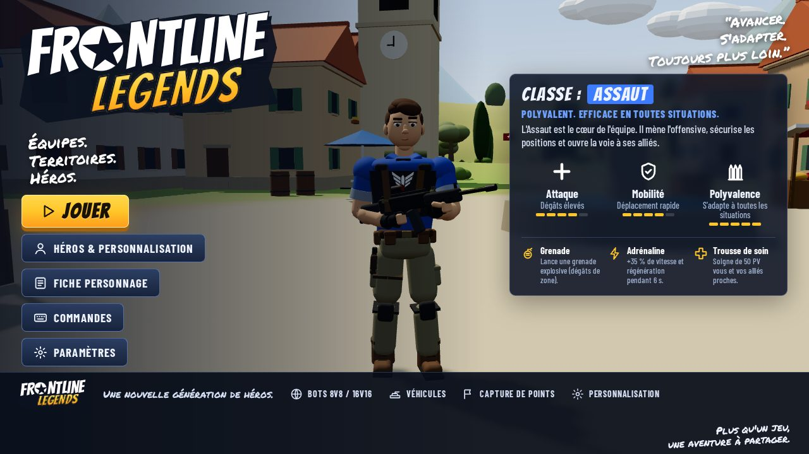
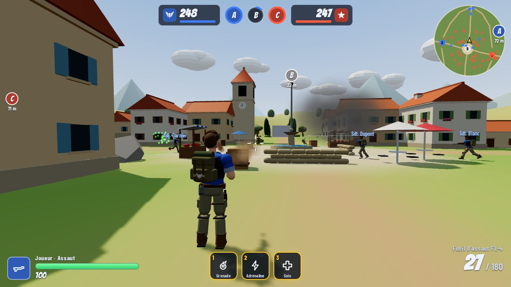
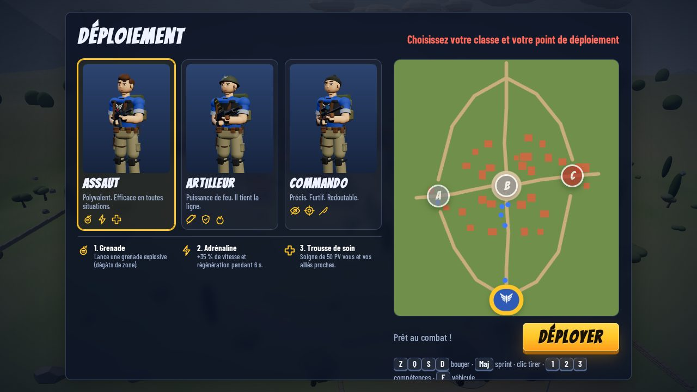

# Frontline Legends — Projet Battle

Jeu de tir **cartoon à la 3ᵉ personne** jouable directement dans le navigateur, dans l'esprit de *Battlefield Heroes* :
deux équipes, trois classes avec compétences, capture de drapeaux, véhicules… et un héros au style « planche de personnage » fidèle au concept de départ.

> *Équipes. Territoires. Héros.*



| En jeu | Déploiement |
| --- | --- |
|  |  |

## Lancer le jeu

Prérequis : [Node.js](https://nodejs.org/) 20 ou plus récent.

```bash
npm install
npm run dev
```

Puis ouvrez l'adresse affichée (par défaut http://localhost:5173). Pour une version optimisée :

```bash
npm run build     # génère le dossier dist/
npm run preview   # sert dist/ en local
```

Le jeu se joue au **clavier et à la souris** sur ordinateur, et **au doigt sur téléphone ou tablette** (mode paysage conseillé). La fiche personnage fonctionne partout.

### Tests de régression

Des tests automatisés rejouent le parcours complet dans un navigateur (Playwright, rendu logiciel) :

```bash
npx playwright install chromium   # une seule fois
npm run test:smoke   # desktop : menu, déploiement, déplacement, tir, dégâts, compétences, pause,
                     # mort/respawn, changement de classe, jeep, char, partie simulée, victoire/défaite
npm run test:touch   # téléphone émulé : joystick, visée, tir, compétences, saut, pause
npm run test:camera  # caméra : jamais dans un mur, un feuillage ou le sol, pas de recul brutal
npm run test:bots    # partie simulée de 3 min : bots bloqués, combats, captures, coût logique
npm test             # les quatre à la suite
npm run shots -- mon-etiquette [turn|poses|sheet|game|fx|ui|all]   # captures avant/après dans test-results/shots/
```

### Mettre le jeu en ligne (GitHub Pages)

Le workflow `.github/workflows/deploy.yml` construit et publie le jeu à chaque push sur `main`.
Il suffit d'activer une fois **Settings → Pages → Source : GitHub Actions** dans le dépôt.

## Ce qu'il y a dedans

- **Mode Conquête** sur la carte *Castelmare*, un village méditerranéen : 3 drapeaux (A — Le Moulin, B — Place du village, C — La Ferme), tickets de renfort, l'équipe qui tient le moins de drapeaux perd des tickets.
- **Deux équipes** : *Les Aigles* (bleu, emblème d'aigle ailé) et *La Légion* (rouge, emblème étoilé).
- **Trois classes**, chacune avec une arme et **3 compétences** (touches `1` `2` `3`) :

  | Classe | Arme | Compétences |
  | --- | --- | --- |
  | Assaut | Fusil d'assaut FL-4 | Grenade · Adrénaline · Trousse de soin |
  | Artilleur | Mitrailleuse M-60L | Roquette · Blindage · Fureur |
  | Commando | Fusil de précision (lunette) | Camouflage · Tir de précision · Poignard |

- **Bots** (8v8 ou 16v16, trois niveaux de difficulté) : navigation A* dans le village (en contournant les véhicules garés), ligne de vue, temps de réaction, mitraillage latéral, utilisation des compétences. Rôles attaque / défense / contournement / soutien ; sous le feu ils se mettent à couvert derrière les sacs de sable et murets, et se replient quand ils sont blessés. La difficulté règle aussi ce comportement tactique, pas seulement la précision.
- **Véhicules** : jeep (rapide, écrase les ennemis) et char (tourelle orientée à la souris, obus explosifs). Suspension (cabrage, plongée, roulis), recul du canon, fumée quand ils sont endommagés, destruction, épave en feu et réapparition à la base.
- **Sensations de tir** : recul propre à chaque arme (vertical pour le fusil, dérive latérale pour la mitrailleuse, gros coup pour le sniper) qui revient de lui-même, douilles, lueur de bouche, traçantes, marqueurs de touche, anneau de rechargement.
- **Caméra 3e personne** qui ne traverse jamais les murs ni les feuillages, cadrage de visée dégagé, champ de vision élargi au sprint.
- **Animations procédurales** : réactions aux impacts selon la direction du tir, réception de saut, pas accordés à la vitesse, pivots sur place, morts en deux temps (trois variantes).
- **Son** synthétisé et spatialisé : tirs étouffés au loin, pas, balles qui sifflent, impacts, vent et oiseaux, jingles de début et fin de partie.
- **Personnalisation du héros** : nom, teint, cheveux, sac à dos, casquette, lunettes, bandana — visibles en jeu.
- **HUD complet** : tickets et drapeaux, mini-carte tournante, fil des éliminations, marqueurs d'objectifs, noms des alliés, dégâts flottants, indicateurs de direction des tirs, barre de compétences avec temps de recharge, lunette de sniper, tableau des scores (`Tab`).
- **Fiche personnage** (`fiche.html`) : la planche de référence du héros, **rendue en direct depuis le modèle 3D du jeu** — vues face/profil/dos, détails du visage et de l'équipement, 6 expressions faciales, accessoires, palette, A-pose, 8 animations clés et échelle. Changez de classe ou d'équipe en un clic.


Tout est **procédural** : personnages, armes, véhicules, village, sons (Web Audio) — aucun fichier 3D, image ou son externe n'est nécessaire.

## Commandes

| Action | Touche |
| --- | --- |
| Se déplacer | `Z` `Q` `S` `D` (AZERTY) ou `W` `A` `S` `D` (QWERTY) |
| Viser / tourner | Souris |
| Tirer / viser | Clic gauche / clic droit |
| Sprinter · Sauter · S'accroupir | `Maj` · `Espace` · `C` ou `Ctrl` |
| Recharger | `R` |
| Compétences | `1` `2` `3` |
| Véhicule (monter / descendre) | `E` |
| Scores · Pause | `Tab` · `Échap` |

**Sur écran tactile** : joystick flottant sous le pouce gauche (poussé à fond vers l'avant pour sprinter), glisser du pouce droit pour viser (le bouton de tir se glisse aussi), boutons Tir / Viser / Saut / Accroupi / Recharger, icônes des compétences à toucher, et invite « Monter dans… » à toucher pour prendre un véhicule. Une légère aide à la visée est active au tactile.

## Organisation du code

```
index.html / fiche.html     pages du jeu et de la fiche personnage
src/config.js               équipes, classes, armes, compétences, difficulté (tout le game design chiffré)
src/character/              héros procédural : corps, visage & expressions, armes, accessoires,
                            animation procédurale avec cinématique inverse des bras
src/game/                   Game (boucle), World (village), physique, navigation A*, soldats,
                            IA des bots, combat & projectiles, conquête, véhicules, effets, audio
src/ui/                     HUD, menus, écrans de déploiement / scores / fin, icônes, portraits
src/sheet/fiche.js          génération de la fiche personnage
```

Pour équilibrer le jeu (dégâts, cadences, temps de recharge, vitesse des classes, tickets…), tout se règle dans `src/config.js`.

## Documentation et suite du projet

- **Base de connaissances : [`docs/INDEX.md`](docs/INDEX.md)** — état vérifié, feuille de route, décisions, carte 1, personnages, systèmes. Le dossier `docs/` s'ouvre aussi comme coffre Obsidian.
- **Installation sur un nouvel ordinateur : [`docs/SETUP_NEW_COMPUTER.md`](docs/SETUP_NEW_COMPUTER.md)** — guide étape par étape pour cloner, installer et lancer le jeu.
- **État actuel : [`docs/CURRENT-STATE.md`](docs/CURRENT-STATE.md)** — ce qui fonctionne, tests, bugs connus, performances.
- **Pour Claude Code : [`docs/CLAUDE_HANDOFF.md`](docs/CLAUDE_HANDOFF.md)** — mémoire pour une session Claude reprenant le projet.
- **Actifs externes : [`docs/EXTERNAL_ASSETS.md`](docs/EXTERNAL_ASSETS.md)** — Medieval Village MegaKit, Master Character, état de transfert.
- **Règles de travail avec Claude Code : [`CLAUDE.md`](CLAUDE.md)** ; procédures dans `.claude/skills/`.
- **Jalon en cours :** **carte 1 au niveau GOLD**, priorité **ENVIRONNEMENT / PRODUCTION DU NIVEAU**. Master Character en pause (D-023). Voir [roadmap](docs/ROADMAP.md) et [décisions](docs/DECISIONS.md).
