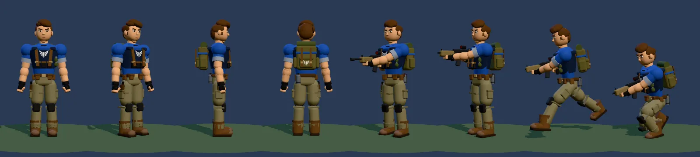

# Master Assault — référence M0 (personnage actuel)

**Statut : étape M0 terminée** (autorisée le 2026-09-29, [audit](MASTER-ASSAULT-AUDIT.md) section 7). **M1 n'est pas autorisée.** Aucun code du jeu n'a changé : `git diff 05827b4 -- src` est vide ; seuls des tests et de la documentation ont été ajoutés.

Mesures dans le conteneur Cloud (Chromium sans GPU, rendu logiciel) : objets de rendu, appels de rendu, triangles, mémoire et alignements sont fiables ; les temps (construction, logique) dépendent de la machine et les FPS ne sont pas mesurables ici.

## 1. Tests ajoutés
| Fichier | Rôle |
| --- | --- |
| `tests/character.mjs` (`npm run test:character`, inclus dans `npm test`) | 53 vérifications : coût par soldat, alignements, planches A/B, partie 16v16, mémoire sur relances, erreurs console. Écrit `test-results/character/metrics.json` et les captures. |
| `tests/character-probe.js` + `tests/character.html` | sonde en lecture seule : construit des personnages dans 25 états d'animation et mesure. Aucune modification du jeu. |
| `tests/baselines/character-m0.json` | mesures complètes de la référence M0 (une exécution), pour les comparaisons chiffrées de M1. |

Les gardes marquées **« problème connu »** encadrent un défaut **déjà présent** : elles empêchent qu'il s'aggrave, ce ne sont pas des objectifs de qualité. Les seuils sont en tête de `tests/character.mjs`.

**Le test détecte bien les régressions** : avec deux mutations temporaires (décalage de la sphère de tête et longueur du bras modifiés, non commitées), 18 vérifications échouent (mains, tête, partie réelle) ; sans mutation, 53/53.

## 2. Coût d'un soldat (déterministe)
| Classe | Maillages visibles / total (jeu) | Triangles | Sommets | Géométrie | Matériaux | Menu (non fusionné) |
| --- | --- | --- | --- | --- | --- | --- |
| Assaut | **18 / 24** | 16 800 (15 900 sans sac) | 50 350 | **1 782 Ko** (1 692 sans sac) | 3 | 174 maillages, 55 matériaux, 44 100 triangles |
| Artilleur | 18 / 24 | 14 900 | 44 700 | 1 584 Ko | 3 | 171 maillages, 39 300 triangles |
| Commando | 18 / 24 | 15 300 | 45 800 | 1 621 Ko | 2 | 157 maillages, 40 200 triangles |

- Les 18 maillages visibles : 15 fusionnés par os, le cou (seul, non fusionné), l'arme fusionnée, le chargeur. Les 6 cachés : éclair de bouche (3), poignard.
- **Soldat seul, couleur + ombre : 36 appels de rendu** (18 + 18), 33 600 triangles.
- La géométrie fusionnée n'est **pas indexée** (3 sommets par triangle) et n'est **pas partagée** entre soldats (couleurs de sommets propres à chacun).
- Mémoire JavaScript : **≈ 1,9 Mo par soldat** fusionné ; entièrement rendue après libération (résidu identique pour 8 ou 32 soldats : pas de fuite).
- Mémoire GPU : 18 géométries envoyées par soldat, **0 restante** après libération (2 cycles).
- Planche A/B **reproductible au pixel près** (deux rendus identiques).

### Temps de construction (rendu logiciel, 3 essais, médiane)
Soldat de jeu (fusionné) : **54 à 82 ms** selon la classe et l'exécution ; modèle du menu (non fusionné) : 28 à 48 ms. C'est ce coût qui produit le pic de 16v16 quand la réserve de modèles est vide.

## 3. Mesures de référence du personnage
| Élément | Valeur |
| --- | --- |
| Hauteur, sommet des cheveux | **1,94 m** en jeu (A-pose), 1,935 m au repos ; 1,97 m au menu |
| Os `head` au repos combat | y = 1,554 m ; `headOffset` = 0,164 m |
| Centre de la sphère de tête au repos | **y = 1,717 m** (rayon 0,17 m dans `Soldier.hitVolumes`) |
| `hipsHeight` | 0,95 m ; 16 articulations ; 60 canaux dans l'Animator |
| Support d'arme en visée (repère du personnage) | (−0,19 ; 1,35 ; 0,21) m, à 0,45 m de l'os `spine` ; au plus 0,475 m sur 23 poses |
| Bouche du canon en visée | Assaut (−0,19 ; 1,36 ; 0,93) · Artilleur (−0,19 ; 1,36 ; 1,12) · Commando (−0,19 ; 1,37 ; 1,06) m |

## 4. Alignements (25 états d'animation, 3 classes)
| Mesure | Assaut | Artilleur | Commando | Garde |
| --- | --- | --- | --- | --- |
| Main droite / poignée (toutes poses tenues) | 0,0 mm | 0,0 mm | 0,0 mm | < 10 mm |
| Main gauche / garde-main, 18 poses stables à deux mains | ≤ 4,7 mm (visée basse) | 0,0 mm | ≤ 7,7 mm | < 10 mm |
| Main gauche en réception | 11,6 mm | 6,9 mm | 18,1 mm | ≤ 22 mm (problème connu) |
| Main gauche pendant le lancer de grenade | 30,3 mm | 26,8 mm | 37,4 mm | ≤ 45 mm (problème connu) |
| Tête visible / sphère, tête droite (11 poses) | ≤ 3,0 cm | ≤ 2,8 cm | ≤ 2,8 cm | < 4 cm |
| Tête visible / sphère, pire pose | 9,4 cm (visée basse) | 9,1 cm (visée haute) | 9,2 cm (visée haute) | ≤ 10 cm (problème connu) |
| Tête couverte par la sphère, au repos | 86 % | 92 % | 93 % | ≥ 80 % |
| Arme / visée debout (horizontale, haute, basse) | ≤ 2,4° | ≤ 2,4° | ≤ 2,4° | < 3° |
| Arme / visée pendant le recul | 5,5° | 5,5° | 5,5° | < 6° |
| Arme / visée **accroupi** | **15,5°** | 15,5° | 15,5° | ≤ 16° (problème connu) |

Hors garde : dans les gestes (soin, boost), la main gauche lâche volontairement l'arme (poids d'IK ≈ 0,1) ; au rechargement, elle va au chargeur (cible atteinte, 0 mm).

## 5. Partie 16v16
Valeurs de plusieurs exécutions (les bots ne jouent jamais deux fois la même partie). Éclairs de bouche cachés pendant la mesure des appels.

| Mesure | Valeur | Garde |
| --- | --- | --- |
| Vue de jeu de référence (place B, 4 directions) : appels totaux | **521 à 865** | mesure |
| … dont soldats | **420 à 729** (13 à 23 par soldat actif, selon ceux dans le champ) | mesure |
| Scène chargée (32 soldats à moins de 18 m de B) : appels totaux | **811 à 966** | mesure |
| … dont soldats | **717 à 810**, soit **22 à 25 par soldat** | ≤ 30 par soldat |
| Triangles des soldats, scène chargée | 615 000 à 669 000 | mesure |
| Logique sur 60 s (1 800 images) juste après le déploiement | **moyenne 3,5 à 3,9 ms**, p99 8,5 à 9,9 ms, max 16 à 70 ms, 1 à 4 images > 16 ms | moyenne < 8 ms |
| Tête visible / sphère sur les soldats réels | moyenne 3,3 à 3,9 cm, max 10,3 à 11,8 cm | moyenne < 5 cm, max ≤ 15 cm |
| Arme / visée, soldats debout en visée stable | moyenne 3,8° | moyenne < 6° |
| Arme / visée, soldats accroupis en visée | moyenne 15,0°, max 20,5° | mesure |
| Mémoire sur 3 relances | 827 → 827 → 827 géométries GPU ; 163 à 166 Mo de mémoire JS, stable | ≤ ×1,05 ; + 5 Mo |

## 6. Captures A/B
| Où | Contenu | Reproductible |
| --- | --- | --- |
| `test-results/character/lineup-<classe>-<équipe>.png` (7 planches) | 8 vues fixes par classe et équipe (face, 3/4, profil, dos, repos, visée, course, accroupi), dont Assaut bleu sans sac | **oui, au pixel près** : base de la comparaison automatique de M1 |
| `test-results/character/crowd-16v16-*.png` | scène chargée 16v16, 4 directions | non (combat en cours) |
| `test-results/shots/m0-baseline/` (`npm run shots -- m0-baseline all`) | 33 captures : vues tournantes, poses, fiche, jeu, effets, HUD | presque (phase de respiration aléatoire) |
| [`docs/_attachments/m0-baseline/`](../_attachments/m0-baseline/) (versionné) | aperçus WebP : 7 planches, poses, vues tournantes, visée, jeu, scène chargée | aperçus pour les humains |

`test-results/` n'est pas versionné et le conteneur est éphémère : pour refaire la référence exacte, se placer sur le commit M0 (`git log --grep "M0 baseline"`) et lancer `npm run test:character` et `npm run shots -- m0-baseline all`.

## 7. Surprises
1. **Hauteur** : 1,94 m au sommet des cheveux, pas 1,80 m (capsule physique). La cible de 1,85 m est plus petite.
2. **La sphère de tête ne suit pas l'inclinaison de la tête** : elle est placée à 0,164 m **à la verticale** de l'os `head`. Tête droite : 2 à 3 cm d'écart ; tête penchée (visée haute ou basse, accroupi) : jusqu'à ~9 cm en pose, ~12 cm en partie réelle ; en visée basse, seuls 25 % des sommets de la tête sont dans la sphère. Comportement de gameplay existant, **non modifié** ; le corriger changerait le gameplay et demande une décision.
3. **Visée accroupie** : l'arme pointe 15,5° sous la ligne de visée (toutes classes), visible sur la planche. Visuel seulement (les balles partent vers le point visé).
4. **Main gauche** hors du garde-main en réception (7 à 18 mm) et au lancer de grenade (27 à 37 mm) : la documentation disait « < 1 cm » ; c'est vrai seulement dans les poses stables.
5. **Coût logique 16v16** : 3,5 à 3,9 ms en moyenne sur les 60 s qui suivent le déploiement, contre 1,66 ms dans [PERFORMANCE](../systems/PERFORMANCE.md). Même code : la fenêtre (début de partie, 32 soldats en combat) et la machine diffèrent. La valeur M0 devient la référence pour le travail sur le personnage ; l'objectif GOLD (< 4 ms) reste tenu de justesse.
6. **Géométrie non indexée** : 50 000 sommets pour 16 800 triangles par soldat ; une réindexation réduirait la mémoire de la géométrie.
7. Aucun code ne dépend du type des os (`Group`) : seul `userData.bone` compte, ce qui simplifie M1.
8. **Hors personnage** : pendant la validation, 1 exécution de `test:bots` sur 5 a échoué sur un code inchangé (un bot bloqué 85 s au drapeau A, le Moulin ; 11,1 % d'échantillons bloqués) ; les 4 autres passent (0 à 0,9 %). Problème de navigation préexistant et intermittent, noté dans [CURRENT-STATE](../CURRENT-STATE.md) ; cause non recherchée ici (ce serait un travail de gameplay, hors M0).

## 8. Ce que M0 ne mesure pas
FPS et mémoire sur un vrai GPU ; coût du rendu d'une peau (skinning) sur téléphone ; son. À vérifier sur une vraie machine quand M1 sera autorisée.
