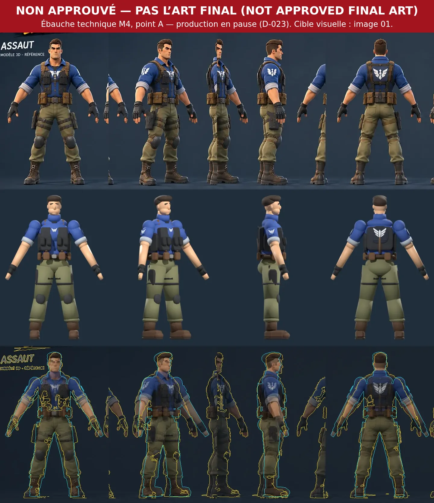
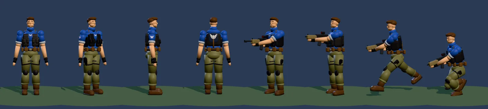
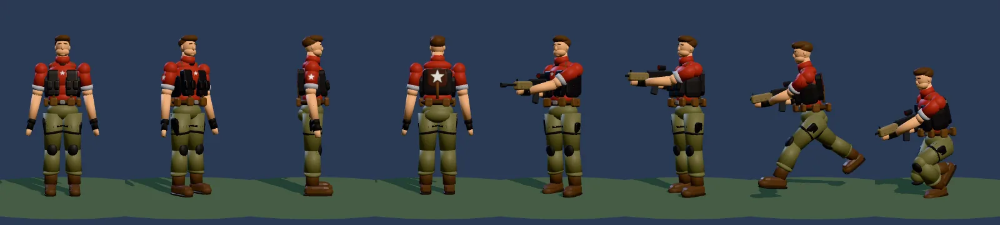
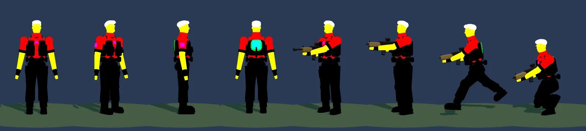

# Master Assault — étape M4 : asset de production (aperçu)

**Statut : EN PAUSE depuis le 2026-09-30 ([DECISIONS](../DECISIONS.md) D-023).**
- Le point de contrôle A (ébauche) est fait techniquement, mais **NON APPROUVÉ comme art final ni comme direction visuelle** (*NOT APPROVED FINAL ART*).
- La production artistique est arrêtée : points B, C et D non faits, aucun affinage du personnage scripté, **pas de M5a**.
- Raison : la modélisation par script dans Blender n'atteint pas la qualité visuelle des références.
- Reprise seulement avec un asset GLB / glTF externe de qualité production ou un meilleur asset 3D : § 8.

M4 avait été autorisée le 2026-09-30 avec les scripts d'aide Blender. Aucun asset de production n'existe dans le jeu. Contrat : [ASSET-CONTRACT](ASSET-CONTRACT.md) · brief : [M4-BLENDER-BRIEF](M4-BLENDER-BRIEF.md) · références : [VISUAL-REFERENCES](../product/VISUAL-REFERENCES.md) · règle d'aperçu : D-020.

## 1. Méthode de production
*Méthode abandonnée pour l'art (D-022 remplacée par D-023). Les outils restent valables pour tout asset (§ 2).*

- **Blender 4.5 LTS, piloté par scripts Python.** Blender tourne dans le conteneur Cloud sous forme du module officiel `bpy` (4.5.14 LTS, Python 3.11, sans interface ; Cycles sur processeur pour les rendus) : **aucun rendu ni export n'est simulé**. Chaque étape de l'asset est un script versionné dans `art/master-assault/` qui régénère le `.blend`, les rendus de revue et le `.glb` à l'identique.
- **Ce que fait Claude** : mesure des références, gabarit et squelette, modélisation par script (volumes, puis maillage continu par subdivision), pondération, masque d'équipe, UV d'emblème, atlas de couleurs, export verrouillé, validation, essai en jeu, planches de comparaison avec les images 01 et 02, intégration (M5a).
- **Ce qui demande un jugement visuel humain** : ressemblance du visage et de la coiffure, qualité des volumes sculptés (plis, cuir, usure peinte), « feeling » général. Le propriétaire juge à chaque point de contrôle ; si la modélisation par script plafonne (visage, cheveux, plis), un artiste peut reprendre le `.blend` au même contrat (gabarit, export, validateur identiques). **Limite connue** : un script ne sculpte pas ; il produit des formes stylisées nettes, pas le rendu peint des images de concept.
- **Pas de primitives JavaScript** : aucune géométrie du Master Assault n'est produite par le code du jeu ; tout passe par Blender et le fichier `.glb`.

## 2. Outils créés (`tools/blender/`, voir son [README](../../tools/blender/README.md))
| Outil | Rôle | Vérifié |
| --- | --- | --- |
| `fl_template.py` | gabarit : unités, 30 i/s, armature du contrat (23 os, noms exacts, A-pose), points d'attache (objets vides), repères (1,85 m, zones de touche), palette du masque | armature exportée acceptée par le validateur |
| `fl_export.py` | export glTF verrouillé (réglages du contrat) + contrôles préalables dans Blender + **validateur automatique** (`--fit` : essai en jeu) | exports réels acceptés |
| `fl_review.py` | vues face / 3/4 / profil / dos à l'échelle exacte de l'image 01 + superposition des silhouettes | planches du point A |
| `fl_selftest.py` | auto-test de toute la chaîne sans art | **accepté** au stade prototype, essai en jeu : mains à 4,7 mm de l'arme, tête à 3,2 cm |
| `export-contract.mjs` | copie JSON du contrat pour Python (vérifiée par `npm run test:rig`) | à jour |

**Premier export d'un vrai fichier Blender** : les noms `upperArm.L` → `upperArmL`, la hiérarchie, la pose de liaison, l'A-pose, les points d'attache (objets vides parentés aux os), les 4 influences normalisées, le masque `COLOR_0` (8 codes), l'atlas PNG et l'essai en jeu (adaptateur + matériau d'équipe) fonctionnent avec l'exportateur de Blender 4.5 : le risque « aucun vrai fichier Blender validé » de M2 et M3 est levé.

## 3. Chaîne : références → Blender → `assault.glb`
1. **Mesure des références** (automatique) : silhouettes de l'image 01 extraites, largeurs et profondeurs par hauteur à l'échelle 1,85 m = 480 px ; repères anatomiques lus sur une grille de 10 cm (§ 5).
2. **Proportions** (`art/master-assault/proportions.json`) : positions des articulations tirées des mesures, dans les tolérances du contrat.
3. **Gabarit** (automatique) : `fl_template.py` avec ces proportions.
4. **Point A — ébauche** (script) : volumes simples sur le squelette → rendus 4 vues + planche de comparaison + export + essai en jeu. *Revue du propriétaire.*
5. **Point B — corps et silhouette des vêtements** (script) : maillage continu du corps (subdivision), coques de vêtements (chemise, gilet, pantalon), harnais et ceinture en volumes propres, équipement placé. *Revue.*
6. **Point C — visage, cheveux, mains, bottes** (script, jugement visuel indispensable) : tête stylisée (mâchoire, sourcils, nez, oreilles), coiffure en volumes, gants mi-doigts, bottes lacées. *Revue ; décision éventuelle de faire intervenir un artiste pour le visage et les cheveux.*
7. **Point D — asset riggé** (automatique pour l'essentiel) : pondération (poids automatiques + corrections par zones), masque d'équipe peint par zones, UV d'atlas et d'emblème, atlas de couleurs (texture simple pour l'aperçu), `M_body`, cheveux bruns canoniques ; `fl_export.py --stade prototype --fit` : **0 erreur**. *Revue* → autorisation de **M5a**.

| Automatisable | Jugement visuel ou manuel |
| --- | --- |
| mesures des références, gabarit, squelette, points d'attache | ressemblance du visage et de la coiffure |
| volumes placés sur les mesures, maillage par subdivision | équilibre des formes sculptées, plis, caractère |
| pondération rigide ou automatique, masque par zones, UV d'emblème | corrections de pondération aux épaules (déformations extrêmes) |
| atlas de couleurs, export, validateur, essai en jeu, planches | texture peinte finale (usure, matières) |

## 4. Points de contrôle
| Point | Contenu | Preuves remises | Statut |
| --- | --- | --- | --- |
| **A** | ébauche : silhouette, proportions, volumes de l'équipement | face, 3/4, profil, dos à côté de l'image 01, silhouettes superposées ; essai en jeu | fait techniquement (§ 5), **non approuvé** (D-023) |
| B | corps et silhouette vêtements / équipement affinés | idem + détail des volumes | **arrêté** (D-023) |
| C | visage, cheveux, mains, bottes | idem + gros plans à côté des détails de l'image 01 et de l'image 02 | **arrêté** (D-023) |
| D | premier GLB riggé pour le validateur | rapport `check:glb --fit` à 0 erreur, captures bleu / rouge / masque | **arrêté** ; à la reprise, remplacé par la validation de l'asset externe (§ 8), puis M5a |

## 5. Point de contrôle A : résultats (référence technique, NON APPROUVÉ)
> **NON APPROUVÉ — PAS L'ART FINAL (*NOT APPROVED FINAL ART*).** Cette ébauche n'est **pas** la cible visuelle ; la cible reste l'image 01 (D-009). L'ébauche est gardée comme preuve technique :
> - squelette, export et essai en jeu fonctionnent ;
> - cas d'essai du validateur ;
> - comparaison historique.
>
> Les planches portent le bandeau « NON APPROUVÉ ».

Script : `art/master-assault/blockout.py` (≈ 7 s dans le conteneur). Ébauche : 14 456 triangles, un seul maillage `body_LOD0`, pondération rigide par volume, 1 matériau, masque d'équipe par volume.

### Mesures de l'image 01 (1,85 m = 480 px)
| Repère | Hauteur | Largeur ou profondeur |
| --- | --- | --- |
| sommet des cheveux | 1,85 m | |
| yeux / menton | ≈ 1,72 / 1,62 m | tête (cheveux compris) 0,23 m de haut : **≈ 8 têtes** (et non 6,5 comme noté avant) |
| base du cou / pivot du crâne | ≈ 1,54 / 1,63 m | cou ≈ 0,13 m |
| deltoïdes | 1,43 m | **0,61 m** d'un deltoïde à l'autre |
| poitrine (gilet) | 1,36 m | profondeur ≈ 0,35 m |
| taille / ceinture | 1,15 / 1,07 m | 0,36 / 0,43 m (poches) |
| entrejambe / genoux | 0,86 / 0,53 m | |
| haut des bottes | 0,30 m | bottes ≈ 0,30 m de long |
| pieds | | écartés, centres à ≈ ±0,26 m |
| bras (A-pose détendue) | | ≈ 29° vers l'extérieur et ≈ 10° vers l'avant ; **épaule → poignet ≈ 0,51 m** |

### Comparaison
| Vue | Recouvrement des silhouettes (référence / ébauche) |
| --- | --- |
| face | 0,68 |
| dos | 0,72 |
| 3/4 | 0,54 (angle de la vue de référence différent de 45°) |
| profil | 0,41 (équipement, plis et poches absents de l'ébauche ; la référence est un rendu en perspective) |

Concordent : hauteur, ligne du sol, hauteur de tête, largeur des épaules, taille, ceinture, genoux, hauteur des bottes, écart des pieds. Écarts voulus ou à traiter : volumes simples sans plis ni poches détaillées (points B et C), bras plus longs que la référence (ci-dessous), visage et cheveux schématiques (point C).

### Essai en jeu de l'ébauche (validateur `--fit`)
Accepté au stade prototype : **mains à 1,2 mm au plus de l'arme** dans les poses tenues, tête à 1,9 cm du centre de sa zone de touche, gameplay intact, bleu (aigle) et rouge (étoile) depuis le même fichier.

### Constats du point A (décision D-021)
1. **Bras** : la référence a des bras courts (≈ 0,51 m de l'épaule au poignet). Avec 0,565 m, la main gauche reste à 36–46 mm du garde-main de l'arme du jeu ; avec 0,60 m, 11 mm en visée basse ; **avec 0,61 m, 1,2 mm**. Le contrat autorisait 0,54 m : il exige maintenant **0,60 m au moins** (règle `PORTEE_BRAS` du validateur). L'ébauche garde 0,30 + 0,31 m : **ses mains descendent plus bas que sur l'image 01**. Raccourcir les bras demanderait de rapprocher l'arme du corps dans le jeu (changement de gameplay et d'animation, hors M4).
2. **Cou et tête** : l'anatomie de l'image 01 place la base du cou vers 1,54 m et le pivot du crâne vers 1,63 m, au-delà des tolérances héritées du squelette procédural (1,48 et 1,56 ± 0,04 m). Tolérances élargies (cou 1,50 ± 0,06, tête 1,59 ± 0,07 m) ; sans effet sur le gameplay (rotations recopiées, zone de touche vérifiée par l'essai : 1,9 cm).
3. **A-pose** : la référence a les bras à ≈ 29–31° de la verticale et portés vers l'avant ; le gabarit accepte maintenant un angle vers l'avant et un léger pli du coude (`arm_forward_deg`, `elbow_bend_deg`) ; l'ébauche est à 30,5° (contrat : 30 à 60°).

## 6. Où vivent les fichiers
| Emplacement | Contenu | Versionné |
| --- | --- | --- |
| `tools/blender/` | scripts de la chaîne (gabarit, export, revue, auto-test), copie JSON du contrat | oui |
| `art/master-assault/` | ébauche du point A **non approuvée** (`blockout.py`, `proportions.json`, [README](../../art/master-assault/README.md)) : référence technique, pas une base de modèle | oui |
| `art/build/` | fichiers produits : `.blend`, `.glb` d'étape, rendus | **non** (régénérés par les scripts) |
| `docs/_attachments/m4/` | planches du point A, avec le bandeau « NON APPROUVÉ » | oui |
| `public/models/characters/assault.glb` | asset du jeu, **n'existe pas** ; à la reprise, l'asset externe accepté par le validateur (§ 8) | oui |

Un `.blend` retouché à la main par un artiste deviendrait une source : il faudrait alors choisir où le garder (Git LFS ou stockage externe), décision du propriétaire.

## 7. Risques
1. **Plafond de la modélisation par script** pour le visage, les cheveux et les plis (point C) : jugement visuel du propriétaire ; artiste possible sur le même contrat.
2. **Bras plus longs que la référence** tant que la tenue de l'arme du jeu ne change pas.
3. **Taille du fichier** : déjà 1,9 Mo pour l'ébauche avec atlas 256² (objectif 1,5 Mo LOD compris) : compression et atlas à décider en M5.
4. **Pondération des épaules** en visée haute et au lancer : à juger en jeu (M5a).
5. **Libellés de l'exportateur** propres à Blender 4.5 : le script les fixe ; une autre version de Blender devra relancer `fl_selftest.py`.
6. **Le conteneur Cloud est éphémère** : l'environnement `bpy` se réinstalle (`pip install bpy==4.5.14`, ≈ 1 min) ; les sources sont les scripts versionnés.

## 8. Reprise (quand un asset externe sera fourni)
Conditions : le propriétaire fournit un GLB / glTF de qualité production, un meilleur asset 3D ou une autre méthode de production (D-023). **Ne pas reprendre la modélisation par script** de `art/master-assault/`.

1. **Contrôle** : `npm run check:glb -- <fichier> --stade prototype --fit`.
   - Les messages du validateur disent quoi corriger : noms d'os, A-pose, échelle, points d'attache, masque `teamMask`, UV `emblem`.
   - Un asset externe demandera en général une adaptation dans Blender. Outils : gabarit d'armature `fl_template.py`, export verrouillé `fl_export.py`, planches `fl_review.py`.
2. **Contrat** : revoir D-021 avec les vraies proportions de l'asset.
   - Un personnage fidèle à l'image 01 a des bras plus courts que 0,60 m.
   - Soit l'asset suit le contrat, soit la tenue de l'arme change (changement de gameplay et d'animation, à autoriser).
3. **Branchement** : adaptateur M2 (`rigAdapter.js`) et matériau d'équipe M3 (`teamMaterial.js`). Le personnage actuel reste en repli (M1 par défaut, legacy disponible).
4. **Aperçu jouable M5a** au plus vite (D-020) : le propriétaire juge silhouette, proportions, mains sur l'arme, lisibilité et sensation en jeu.
