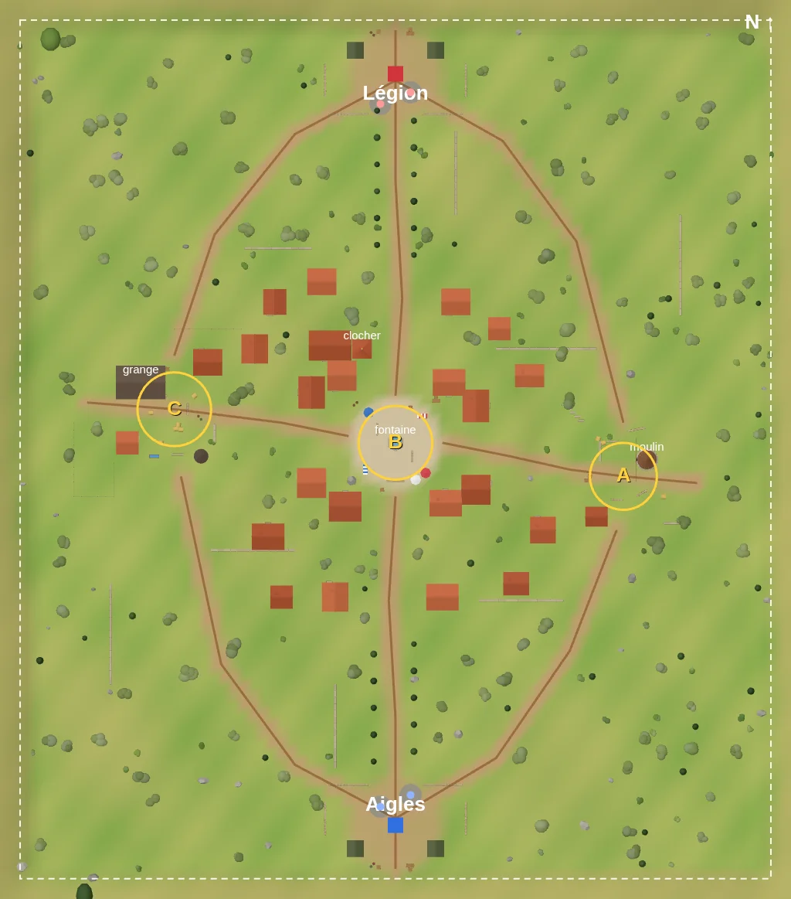

# Carte 1 — chaîne d'environnement : état, architecture, génération

**Statut : préparation faite, kit non livré (2026-09-30).**
- Faits : registre sémantique, outils d'ingestion et d'inventaire, chargeur et empreinte des ancres de gameplay, tous testés (`npm run test:env`) ; le jeu n'est pas modifié.
- La suite attend le kit (§ 6) et l'autorisation de chaque étape (§ 3).
- Décisions : [D-024](../DECISIONS.md) (kits tiers remplaçables), [D-025](../DECISIONS.md) (architecture, proposée).
- Registre : [MAP1-ASSET-REGISTRY](MAP1-ASSET-REGISTRY.md). Ingestion et inventaire : [MAP1-ASSET-INVENTORY](MAP1-ASSET-INVENTORY.md).
- Level design : [LEVEL-DESIGN](LEVEL-DESIGN.md). Critères : [MAP1-GOLD](MAP1-GOLD.md).

## 1. État réel de la carte 1 (vérifié sur `29a22aa`)



*Vue aérienne réelle, comme sur la mini-carte du jeu. Le schéma ASCII de [LEVEL-DESIGN](LEVEL-DESIGN.md) place A à gauche avec la Légion en haut : c'est une vue en miroir, utile comme plan mais inversée par rapport au terrain.*

### Où vit la carte
| Fichier | Rôle | Nature |
| --- | --- | --- |
| `src/game/map.js` | limites, bases, drapeaux A / B / C, véhicules, 8 routes (polylignes), zones aplanies, relief analytique `terrainHeight`, générateur `rng` | **données** (ancres de gameplay) |
| `src/game/World.js` | construit tout le décor : ciel, relief, village, moulin, ferme, bases, dispersion, couverts ; **et, dans les mêmes fonctions**, les collisions, les boîtes « caméra seule » et les empreintes | code, positions écrites en dur |
| `src/game/physics.js` | boîtes alignées (AABB) étiquetées `solid`, `cover` (sacs de sable, utilisés par les bots), `nobullet` (clôtures) ; boîtes caméra | moteur |
| `src/game/nav.js` | grille A* de 1,5 m construite **depuis les collisions** au chargement | dérivé |
| `src/game/Conquest.js` | drapeaux, zones de capture, points de déploiement | lit `MAP` |
| `src/ui/HUD.js` | mini-carte : routes de `MAP` et bâtiments **dessinés depuis les collisions** (boîtes de plus de 4 m de haut et 3 m de large) | dérivé |
| `src/game/Game.js` | ordre de construction : `Physics` → `World` → `NavGrid` | |

### Déploiements, objectifs, routes
- **Bases** : `MAP.bases` : Aigles (0 ; −112), Légion (0 ; 112), avec l'orientation.
- **Déploiement** (`Conquest.spawnOptions` / `spawnPosition`) : base ou drapeau tenu. La position est tirée au hasard à 2–9 m de la base ou à 5–13 m du drapeau, sur une case libre de la grille, à plus de 8 m d'un ennemi.
- **Véhicules** : 4 emplacements fixes dans `MAP.vehicles` (jeep et char par équipe).
- **Objectifs** : `MAP.points` :
  - A le Moulin (−68 ; −8), rayon 10 m ;
  - B la Place (0 ; 2), rayon 11 m, mât décalé de 3,8 m (fontaine) ;
  - C la Ferme (66 ; 12), rayon 11 m.
  Capture : soldats dans le rayon, à moins de 6 m en hauteur.
- **Routes** : 8 polylignes, 2 nord-sud, 2 vers A et C, 4 diagonales des bases vers A et C. Elles servent :
  - à la couleur du terrain ;
  - à l'exclusion de la dispersion (4,5 m de chaque côté) ;
  - à la mini-carte.
  La praticabilité pour les véhicules n'est garantie que par l'absence d'obstacles.
- **Relief** : analytique, aplani autour du village, des drapeaux et des bases. Collines au-delà des limites.

### Ce qui est codé en dur, ce qui est en données
| En données | En dur dans `World.js` |
| --- | --- |
| limites, bases, drapeaux, véhicules, routes, relief, zones aplanies | 24 maisons (10 à un étage, 14 à deux ; 6 × 5 à 12 × 8 m), clocher, fontaine, moulin, grange, château d'eau, abreuvoir |
| | 20 caisses, 9 tonneaux, 18 lignes de sacs de sable, 12 murets (122 blocs), 4 clôtures, 9 bottes de foin, 2 étals, 3 tables, 4 tentes, 4 plateformes |
| | 22 cyprès en allées (routes nord et sud) ; dispersion à graine fixe : 120 oliviers, 28 cyprès, 61 buissons, 29 rochers, 70 arbres hors limites |

*Comptes mesurés en comptant les appels des constructeurs de `World.js` (2026-09-30).*

### Couplages à respecter
1. **Un seul générateur aléatoire** pour tout le décor. Toute construction tire des nombres (couleurs, cheminées, fenêtres…). Changer le nombre de tirages avant `buildScatter()` déplace les arbres, les buissons et les rochers, donc les collisions et la navigation. La dispersion évite aussi les **empreintes** des bâtiments.
2. **Visuel et gameplay dans les mêmes fonctions** : chaque constructeur dessine **et** pose ses collisions.
3. **Fusion du décor** (`bakeStatic`) : tout le décor à couleurs de sommets devient 4 maillages et 1 matériau. Un maillage **texturé** (cas d'un kit glTF) est gardé à part : un appel de rendu par pièce si rien n'est fait.
4. **Mini-carte et navigation** sont dérivées des collisions : elles suivront automatiquement toute disposition, pourvu que les collisions viennent des données sémantiques.

### Ancres à garder fixes (protégées par `npm run test:env`)
Empreinte de référence : `tests/baselines/map1-anchors.json`.

| Élément | Référence |
| --- | --- |
| Ancres (bases, drapeaux avec rayon et mât, véhicules, routes, limites) | empreinte exacte |
| Relief (957 hauteurs tous les 8 m) | empreinte exacte |
| Collisions du décor | 412 boîtes : 390 `solid`, 18 `cover`, 4 `nobullet` |
| Boîtes caméra | 544 |
| Navigation | 2 297 cases bloquées sur 150 × 171 (cases de 1,5 m) |
| Décor fusionné | 4 maillages, 213 028 triangles, 1 matériau ; 193 maillages dans la scène (ciel, nuages, montagnes, relief…) |

Un déplacement de 50 cm d'une caisse est détecté par l'empreinte des collisions (essai de mutation). Une collision, une boîte caméra ou une case de navigation qui change doit être **voulue**. La référence se met alors à jour (`npm run test:env -- --update-baseline`) avec une décision.

## 2. Architecture proposée ([D-025](../DECISIONS.md), en attente)
```
ancres de gameplay (map.js : bases, drapeaux, véhicules, routes, relief)          ← fixes
        │
disposition de la carte 1, en données : [{ id sémantique, x, z, rotY, params }]    ← étape E4, puis générateur
        │
        ├──► gameplay : collisions et boîtes caméra depuis le CATALOGUE (emprise, hauteur, étiquette)
        │              → Physics → NavGrid, mini-carte          (jamais depuis un maillage de fournisseur)
        │
        └──► visuel : registre (catalog.js + kits/*.js) → EnvAssetLibrary → instances du kit
                      ou repli : constructeur actuel de World.js si l'identifiant n'est pas lié
                      → fusion par matériau / instanciation → scène
```
Principes :
- **Gameplay d'abord.** La carte est définie par ses ancres et sa disposition. Le visuel habille ; il ne décide ni des collisions ni de la navigation.
- **Remplaçable.** Un fichier de fournisseur n'apparaît que dans `src/environment/kits/`. Changer de kit ou passer aux assets Frontline Legends ne change que les liaisons.
- **Repli par identifiant.** Un identifiant non lié garde le décor actuel, ce qui permet une migration progressive.
- **Comparaison A/B** : un réglage `?decor=kit|procedural`, comme `?rendu=legacy`, avec le décor actuel par défaut tant que le propriétaire n'a pas validé.

Fait dans cette session :

| Élément | Fichier |
| --- | --- |
| catalogue de 35 identifiants | `src/environment/catalog.js` |
| registre, résolution par priorité, validation | `src/environment/registry.js` |
| paquet du kit, sans liaison | `src/environment/kits/` |
| chargeur (non branché) | `src/environment/EnvAssetLibrary.js` |
| ingestion et inventaire | `tools/env-kit/` |
| test : empreinte, garde, outils, chargeur | `tests/env.mjs` |

Non fait : disposition en données, assemblage visuel, réglage `?decor`.

## 3. Étapes d'intégration (chacune proposée puis autorisée séparément)
| # | Étape | Preuve | Risque |
| --- | --- | --- | --- |
| E1 | **Livraison et ingestion** du kit (§ 6), licence lue (dépôt **public**) | `kit-manifest.json`, fichiers identiques octet pour octet | licence, taille |
| E2 | **Inventaire** et **planche visuelle** des assets, jugement du style par le propriétaire | `docs/map1/inventories/`, captures | style « médiéval » face au village méditerranéen de l'image 03 |
| E3 | **Liaisons** : modules du kit → identifiants ; prefabs assemblés (maisons) ; contrôle « l'asset tient dans l'emprise » | `test:env` | échelle, pivots |
| E4 | **Disposition actuelle extraite en données**, sans rien changer au jeu | empreinte identique | faible |
| E5 | **Chemin non destructif `?decor=kit`**, en trois points (ci-dessous) | captures A/B, `npm test`, mesures 16v16 | appels de rendu |
| E6 | **Disposition en données comme source** (World.js n'invente plus de positions) : empreinte mise à jour volontairement | décision, `test:bots` | navigation |
| E7 | **Générateur semi-automatique** (§ 4) | disposition revue, vue aérienne, tests | équilibre |

Les trois points de l'étape E5 :
1. le décor actuel est construit « à blanc » : collisions, tirages et navigation restent identiques ;
2. son habillage est remplacé par les assets liés ;
3. les pièces sont fusionnées par matériau.

## 4. Génération automatique ou semi-automatique (proposition)
**Menée par le gameplay, jamais aléatoire pour le plaisir.** Le générateur est un **outil hors du jeu**, déterministe (graine). Il produit une disposition en données que l'on regarde (vue aérienne, captures) puis que l'on commite. Le jeu lit cette disposition et ne génère rien en partie : la carte est stable pour les joueurs et pour les tests.

**Entrées fixes :**
- ancres : bases, drapeaux avec rayon, mât et zone libre, emplacements des véhicules ;
- routes des véhicules : polylignes de `MAP.roads`, couloir libre pour le char ;
- chemins d'infanterie : au moins deux approches par drapeau ;
- lignes de combat ;
- exigences de couvert : un couvert tous les 6 m au plus dans une zone de capture, de 0,7 à 1,8 m ;
- lignes de vue de 80 m au plus vers un drapeau ;
- zones interdites (drapeaux, bases, routes, place) ;
- repères à garder visibles : moulin, clocher, grange.

**Étapes :**
1. **Zonage** : place, centre du village, champs, ferme, moulin, bases, bords de route, arrière-plan. Ce sont les étiquettes de zone du catalogue.
2. **Îlots et parcelles** entre les routes et les chemins d'infanterie. Rues larges (véhicules) ou ruelles de 2 à 3 m (`infantry-only`).
3. **Bâtiments par parcelle** : prefab choisi selon la taille et la zone (`HOUSE_SMALL_A`, `HOUSE_MEDIUM_A`…), façade vers la rue, densité par zone.
4. **Variations** (toit, balcon, cheminée, porte) par **sous-graine de parcelle** = hachage(graine de la carte, identifiant de parcelle). Modifier une parcelle ne déplace plus rien ailleurs, contrairement au générateur unique actuel.
5. **Passe de couverts** : compléter jusqu'à respecter l'espacement, avec le type adapté à la zone (sacs de sable à la place et aux bases, caisses et tonneaux au village, foin à la ferme, murets aux champs).
6. **Décor sans collision** : accessoires, plantes, arrière-plan.
7. **Validation automatique** :
   - couloirs des véhicules libres ;
   - deux approches par drapeau ;
   - lignes de vue ;
   - espacement des couverts ;
   - chaque déploiement relié à chaque drapeau ;
   - aucune ancre recouverte ;
   - puis `test:bots` et `test:camera`.
8. **Sortie** : disposition en données, vue aérienne annotée, rapport de validation. Revue du propriétaire, puis commit.

## 5. Performance et risques
- **Appels de rendu** : 156 à 265 aujourd'hui en vue de jeu 16v16 ([PERFORMANCE](../systems/PERFORMANCE.md)), objectif 250. Un village en pièces texturées doit être **fusionné par matériau** au chargement (ou instancié par pièce), avec ombres et distances maîtrisées. Mesure obligatoire à l'étape E5.
- **Licence** : le dépôt GitHub est **public**. Committer le kit le redistribue, ce que la licence doit autoriser ; sinon, arrêt et autre stockage à décider.
- **Style** : un kit « Medieval Village » peut ne pas correspondre au village méditerranéen de l'image 03 (D-009). À juger sur la planche de l'étape E2 : teintes et matériaux modifiables, architecture non.
- **Taille** : le dépôt pèse 6 Mo. GitHub avertit au-delà de 50 Mo par fichier et refuse au-delà de 100 Mo. Git LFS n'a pas été essayé avec le proxy Cloud.
- **Échelle, axes, pivots** du kit : inconnus, mesurés par l'inventaire.
- **Verticalité** (escaliers, terrasses) : c'est un changement de gameplay (marche maximale de 0,45 m, IA, caméra), qui demande une décision séparée. Les identifiants existent, marqués « prévu ».
- **Moulin** : les ailes tournent ; un asset doit séparer le corps et le moyeu.

## 6. Livraison du kit attendue
Le kit n'a pas pu être envoyé dans la session Cloud (archive trop grosse). **Seuls** le dossier glTF et le fichier de licence sont nécessaires : ni FBX, OBJ, Blend, Unity ou Unreal, ni les aperçus.

**Préalable, pour le propriétaire** : le dépôt est **public**. Pousser le kit, c'est le publier. Avant la méthode A, vérifier dans `License_Standard.txt` que la redistribution des fichiers (dans un dépôt public et un jeu publié) est permise. En cas de doute, utiliser la méthode B : rien n'est publié tant que la licence n'est pas lue.

**Méthode A, recommandée si la licence le permet (la plus fiable)** : le propriétaire pousse les fichiers sur la branche de travail depuis sa machine, puis la session suivante lance l'ingestion.
```
Projet-Battle/                         (branche claude/dazzling-cray-gn1bg5)
  vendor-drop/medieval-village-megakit/
    License_Standard.txt               ← fichier de licence, tel quel
    glTF/                              ← dossier glTF du kit, TEL QUEL (sous-dossiers et textures compris)
      Balcony_….gltf, Balcony_….bin, …
      (textures .png à l'endroit où les .gltf les attendent)
```
Commandes sur la machine du propriétaire :
```
git pull
<copier les deux éléments ci-dessus dans vendor-drop/medieval-village-megakit/>
git add vendor-drop
git commit -m "chore(map1): drop Medieval Village MegaKit glTF folder and license"
git push
```

**Méthode B** : une archive `.zip` qui ne contient **que** ces deux éléments (souvent bien plus petite que l'archive complète), jointe à la session.

Dans les deux cas, la session suivante :
1. lit la licence et **s'arrête** si la redistribution dans un dépôt public n'est pas permise. Avec la méthode B, rien n'est alors commité ;
2. lance `node tools/env-kit/ingest.mjs --from vendor-drop/medieval-village-megakit --pack medieval-village-megakit`. Le kit est copié dans `public/kits/medieval-village-megakit/` avec ses chemins intacts ;
3. retire `vendor-drop/` : le kit n'est gardé qu'une fois dans l'arbre, et Git ne stocke qu'une fois des fichiers identiques ;
4. lance l'inventaire.

Si un fichier dépasse 100 Mo, ou si le total dépasse quelques centaines de Mo, **arrêt** : le stockage (Git LFS, dépôt séparé) est à décider par le propriétaire.

### 6.1 État de la livraison (vérifié le 2026-10-02)
- **Licence lue** (`License_Standard.txt`) : **CC0 1.0 Universal** (domaine public), modèles de Quaternius, édition gratuite « Standard » (une partie des modèles du kit complet). La redistribution dans ce dépôt public est **permise**.
- **Dossier Google Drive** partagé par le propriétaire (`vendor-drop/Medieval Village MegaKit[Standard]`) : `glTF/`, `Textures/`, `FBX/`, `OBJ/` et la licence. Le dossier `glTF/` compte **374 fichiers** (176 `.gltf`, 176 `.bin`, 22 `.png`, 60 397 537 octets) et aucun sous-dossier. Les textures utiles aux glTF sont **dans** ce dossier ; `Textures/` (32 PNG, 99,6 Mo) sert aux autres formats.
- **Transfert vers le conteneur Cloud** :
  - la politique réseau de l'environnement refuse `drive.google.com`, `drive.usercontent.google.com` et `docs.google.com` ; l'API `www.googleapis.com` demande une clé ;
  - le connecteur Google Drive enregistre sur disque, **octet pour octet**, les fichiers d'environ 90 Ko et plus (vérifié : les 22 PNG, 54 Mo) ;
  - en dessous d'environ 60 Ko, il renvoie le contenu **dans la conversation**, et il faudrait le recopier à la main : ce n'est **pas fiable**. Or **310 fichiers sur 374** font moins de 20 Ko (les `.gltf` et la plupart des `.bin`).
- **Essai du 2026-09-30 / 10-01** : 265 fichiers sur 374 récupérés, dont les 22 PNG fiables ; une partie des petits fichiers a été recopiée à la main. Ces copies ne sont **pas utilisées** : elles sont rangées hors du dépôt, et rien n'est commité.

**Méthode C (la plus simple maintenant)** : une seule archive, `glTF-geometrie.zip`, avec **uniquement les 352 fichiers `.gltf` et `.bin`** du dossier `glTF/` (6,3 Mo, environ 2 Mo compressés), déposée dans le dossier Drive `vendor-drop`. Une archive de cette taille arrive octet pour octet en un seul téléchargement ; les 22 PNG sont déjà récupérés. La méthode A (envoi Git depuis la machine du propriétaire) reste possible : la licence CC0 le permet.
