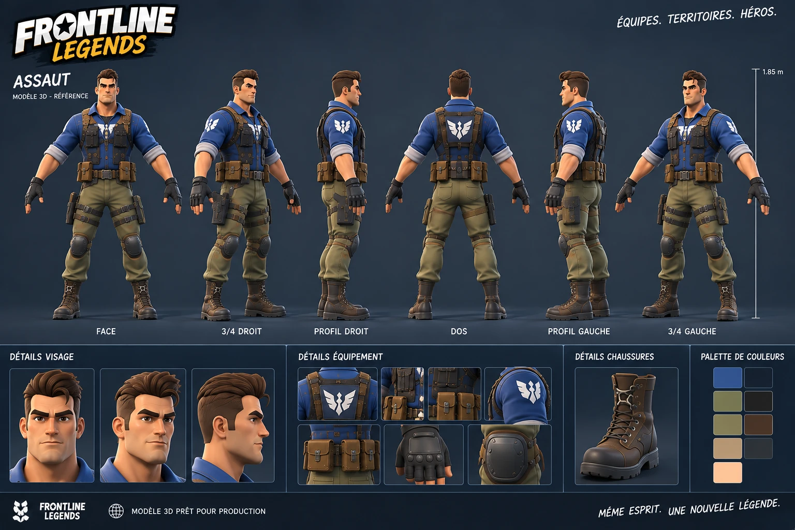
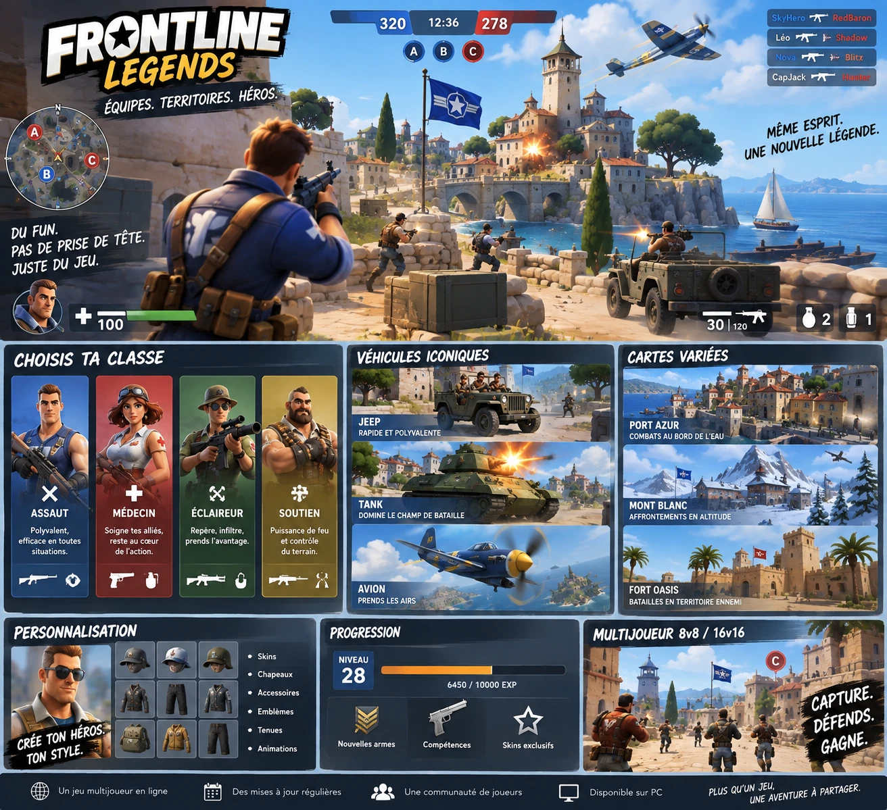
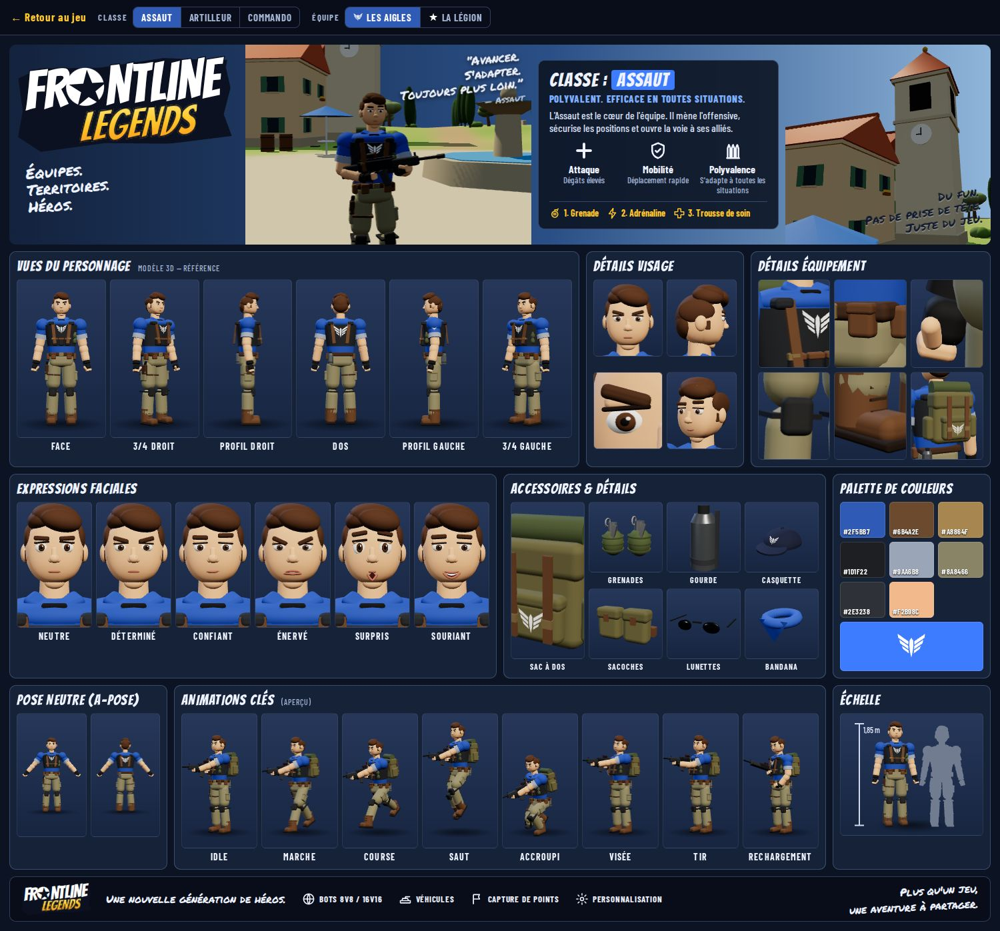

# Direction artistique

Style **cartoon héroïque, lisible, coloré**, dans un village méditerranéen ensoleillé. Identité propre : *Frontline Legends*, soldat Assaut bleu à l'aigle ailé.

## Références officielles
**[VISUAL-REFERENCES](VISUAL-REFERENCES.md)** (décision D-009) : image 01 (vues tournantes du Master Assault) et image 03 (cible visuelle en jeu) font autorité ; image 02 détaille le personnage ; image 04 donne la vision produit à long terme **sans rien autoriser** ; *Battlefield Heroes* n'est qu'une inspiration de lisibilité, **jamais reproduite**.

| Personnage (image 01) | En jeu (image 03) |
| --- | --- |
|  |  |

Rendu actuel du personnage procédural, à comparer à ces références (`fiche.html`) :

## Personnages
- Proportions héroïques : tête légèrement surdimensionnée, épaules larges, taille fine, avant-bras lisibles, mains et bottes légèrement exagérées, haut du corps fort.
- Cheveux stylisés en volumes simples, visage expressif (sourcils, bouche, yeux lisibles).
- **Silhouette propre à chaque classe** : Assaut (en jeu aujourd'hui : sac à dos et grenades ; cible de l'image 01 : tête nue, harnais, ceinture à poches, étui de cuisse, sac en accessoire — à confirmer), Artilleur (casque, épaulières, bandoulière, carrure 1,12), Commando (bonnet, écharpe, étui de couteau, carrure 0,95).
- Équipement identifiable (gilet, harnais, ceinture à poches, emblèmes poitrine, manches et dos).
- Détails complets : [MASTER-ASSAULT](../characters/MASTER-ASSAULT.md).

## Couleurs d'équipe
| | Les Aigles | La Légion |
| --- | --- | --- |
| Maillot | `#2F5BB7` bleu | `#B2382C` rouge |
| Gilet | `#29344A` | `#4A2C27` |
| Pantalon | `#8A8466` olive | `#5A5C50` gris-vert |
| Emblème | aigle ailé | étoile |

Valeurs actuelles du jeu (`src/config.js`). La palette relevée sur l'image 01 est dans [VISUAL-REFERENCES](VISUAL-REFERENCES.md) ; l'harmonisation se fera avec le Master Assault.

La couleur d'équipe doit rester dominante sur le haut du corps et visible de dos (emblème du dos, bande du casque ou du bonnet, sac quand il est porté).

## Armes
Silhouettes épaisses et lisibles, légèrement surdimensionnées (×1,12), crosse et garde-main tan `#8B7A57`, métal sombre. Chaque arme se reconnaît à sa forme : fusil compact avec viseur rouge, mitrailleuse massive à caisson, sniper long à grosse lunette.

## Environnement
- Village méditerranéen : murs crème à ocre, toits de tuiles orangées, volets colorés, pierres d'angle, balcons en fer forgé, jardinières fleuries.
- Oliviers, cyprès, murets de pierre sèche, bottes de foin, moulin, ferme à grange rouge.
- Couverts de combat lisibles (sacs de sable, murets) : leur forme dit « je protège ».

## Lumière et rendu
- Soleil méditerranéen chaud, ombres douces, ciel bleu dégradé, brume légère au loin ; cible : image 03 (ciel bleu franc, cumulus, pierre chaude, image nette).
- Rendu des tons *Neutral* (Khronos PBR Neutral) : couleurs franches sans sursaturation.
- **À éviter** : bloom excessif, flou de mouvement, profondeur de champ, couleurs boueuses, surexposition, encombrement visuel, réalisme granuleux.

## Effets
Stylisés et courts : lueur de bouche, traçantes teintées par équipe, étoiles de touche, poussière, fumée claire qui se dissipe vite et s'efface près de la caméra.

## Validation
Toute modification visuelle suit la skill `visual-validation` (captures avant/après, lisibilité à 5/20/40 m, test bleu/rouge).
