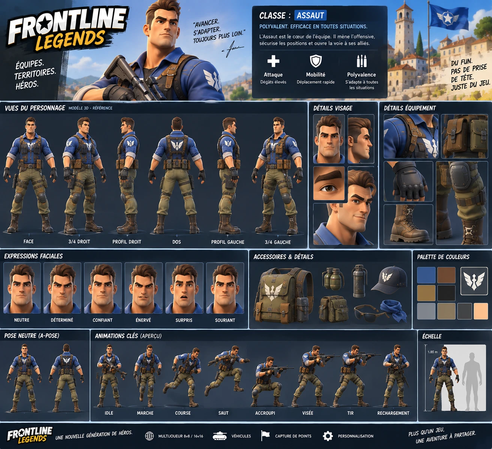
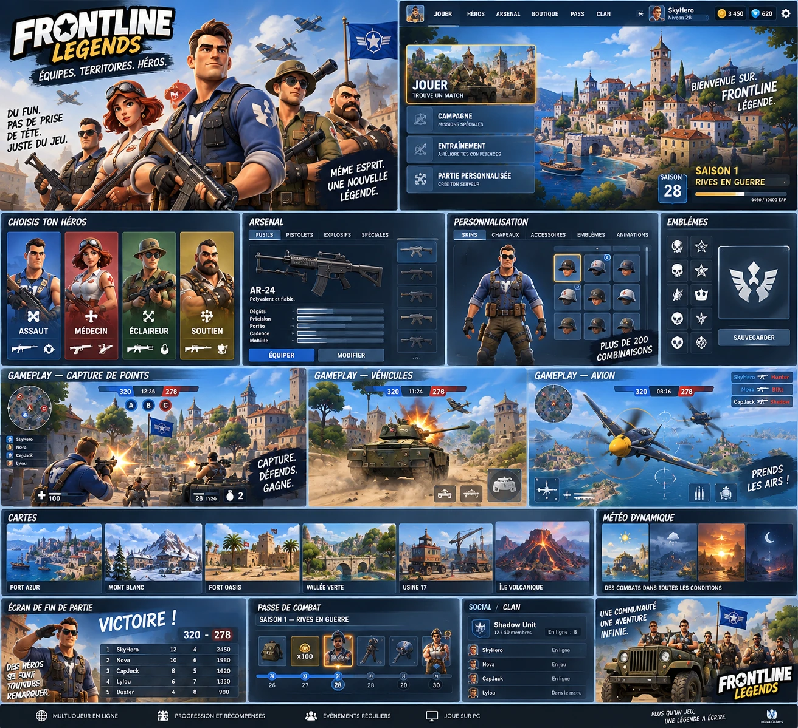

# Références visuelles officielles

**Statut : officiel** (fourni par le propriétaire du projet le 2026-09-29, décision [D-009](../DECISIONS.md)). Ces images fixent l'**intention visuelle** ; elles ne décrivent pas l'état du jeu (voir [CURRENT-STATE](../CURRENT-STATE.md)) et n'élargissent pas le périmètre (voir [CLAUDE.md](../../CLAUDE.md), gel du périmètre).

## Hiérarchie

| N° | Fichier | Rôle | Autorité |
| --- | --- | --- | --- |
| 01 | [ref-01-master-assault-turnaround.webp](../_attachments/ref-01-master-assault-turnaround.webp) | vues tournantes du Master Assault | **primaire** pour le personnage |
| 02 | [ref-02-master-assault-production-sheet.webp](../_attachments/ref-02-master-assault-production-sheet.webp) | planche de production du Master Assault | secondaire (détails) |
| 03 | [ref-03-gameplay-visual-target.webp](../_attachments/ref-03-gameplay-visual-target.webp) | cible visuelle en jeu | **primaire** pour la présentation en jeu |
| 04 | [ref-04-product-ui-vision.webp](../_attachments/ref-04-product-ui-vision.webp) | vision produit et interface, long terme | cohérence seulement, **n'autorise rien** |
| 05 | *non versionnée* (voir plus bas) | inspiration *Battlefield Heroes* | inspiration seulement, **ne jamais reproduire** |

*Frontline Legends* et les images 01 à 04 sont l'autorité visuelle. Dans le message d'origine, les images 03 et 04 ont été jointes dans l'ordre inverse de leur numéro ; l'attribution ci-dessus suit leur **contenu** (03 = capture de jeu avec HUD ; 04 = menus, boutique, passe, clan) et a été **confirmée par le propriétaire**.

## Règles d'usage
1. **Personnage** : l'image 01 prime ; l'image 02 complète (expressions, accessoires, poses, échelle). En cas de conflit entre elles, l'image 01 l'emporte.
2. **En jeu** (caméra, lisibilité, décor, lumière, HUD, effets, véhicules) : l'image 03 prime.
3. **Image 04** : cohérence visuelle et présentation future du produit. Elle **n'autorise pas** : nouvelles cartes, passe de combat, serveur multijoueur, clans, progression, boutique, ni aucun contenu supplémentaire.
4. **Image 05** : qualités à comprendre, jamais d'éléments à copier.
5. Ce sont des images de concept, pas des modèles : elles fixent l'intention, pas des cotes exactes. Les couleurs relevées ci-dessous sont **approximatives** (image compressée).
6. Une règle technique ou de gameplay déjà fixée (hitboxes, budgets, lisibilité bleu/rouge, [DECISIONS](../DECISIONS.md)) n'est jamais modifiée en silence à cause d'une référence : le conflit est noté ici et soumis au propriétaire.
7. Les images sont des maquettes générées, **pas des documents de game design cohérents**. Quand l'une d'elles contredit l'identité canonique du jeu (emblèmes d'équipe, règles de la conquête), on la **réinterprète** avec l'élément canonique ([D-011](../DECISIONS.md), [D-013](../DECISIONS.md)).
8. Une référence n'est pas une preuve : un changement est validé par captures du jeu (skill `visual-validation`), comparées aux références.

---

## 01 — Master Assault, vues tournantes (autorité primaire du personnage)

Fait autorité pour : proportions, silhouette, visage, coiffure, vêtements, équipement tactique, gants, genouillères, bottes, placement des emblèmes, aspect des matériaux, palette, vues face / 3/4 / profil / dos.

| Élément | Lecture de la référence |
| --- | --- |
| Stature | **1,85 m** (échelle de la planche), environ 6,5 têtes, pose en A |
| Corps | athlétique, torse en V, épaules larges, avant-bras et mains forts, jambes solides, bottes massives |
| Visage | mâchoire carrée, menton marqué, sourcils épais et sombres, yeux bruns, léger sourire assuré |
| Cheveux | brun foncé, côtés courts dégradés, dessus volumineux relevé vers l'arrière, mèche avant marquée |
| Haut | chemise **bleue** à col pointu ouvert, tee-shirt sombre dessous, manches courtes **retroussées** au-dessus du coude, revers **gris clair** |
| Emblèmes (blancs) | poitrine (au centre, entre les pans du gilet) · **les deux manches** (haut du bras) · **grand emblème du dos** sur un panneau bleu nuit du harnais, entre les omoplates |
| Gilet | porte-chargeurs très sombre, ouvert devant, poches à rabat sur la poitrine ; **harnais en cuir brun** (bretelles devant, en Y dans le dos) |
| Ceinture | cuir brun, boucle métallique, **poches brunes à rabat tout autour**, y compris dans le dos |
| Pantalon | cargo **olive**, ample, rentré dans les bottes, poches arrière à rabat, sangles sur les deux cuisses |
| Cuisses | **étui de pistolet noir sur la cuisse droite**, poche noire sur la cuisse gauche |
| Genoux | genouillères noires sanglées |
| Mains | **gants noirs mi-doigts**, jointures rembourrées, bracelet |
| Pieds | bottes de cuir brun lacées, mi-mollet, crochets métalliques, semelle sombre épaisse |
| Absents | **pas de sac à dos**, pas de grenade visible, pas de coiffe, pas d'arme sur la planche |
| Matériaux | rendu 3D stylisé ; toile, cuir, caoutchouc et métal se distinguent ; **usure légère peinte** (poussière sur le pantalon, éraflures des bottes et du cuir) ; pas de saleté réaliste ni de bruit |

### Palette relevée sur la planche (valeurs approximatives)
| Nuancier | Relevé | Usage probable | Valeur actuelle en jeu (`src/config.js`) |
| --- | --- | --- | --- |
| bleu | `#32548F` | chemise (couleur d'équipe) | `#2F5BB7` (`TEAMS.blue.shirt`) |
| bleu nuit | `#15202E` | panneau du dos, gilet | `#29344A` (`TEAMS.blue.vest`) |
| olive | `#787752` | pantalon | `#8A8466` (`TEAMS.blue.pants`) |
| olive clair | `#837B55` | reflets du pantalon, toile | — |
| noir | `#212121` | gants, poches, genouillères | `#1D1F22` (`PALETTE.noir`) |
| brun foncé | `#493427` | cuir, bottes | `#6B4A2E` (`PALETTE.cuir`) |
| tan | `#B59673` | cuir clair, poches | `#A8864F` (`PALETTE.kaki`) |
| ardoise | `#2E3338` | métal, boucles | `#3A3D42` (`PALETTE.anthracite`) |
| peau | `#FDC598` | teint par défaut | `#F2B98C` (`PALETTE.peau`) |

Le bleu de référence est plus sombre et moins saturé que le bleu actuel du jeu. **Aucune valeur du jeu n'est changée à cette étape** : l'harmonisation se fera avec l'asset du Master Assault et sera validée par le test bleu/rouge et la lisibilité à 40 m ([MASTER-ASSAULT](../characters/MASTER-ASSAULT.md), section 5). La planche ne montre que l'équipe bleue ; la variante rouge (La Légion, étoile) vient du masque de couleurs d'équipe.

## 02 — Master Assault, planche de production (secondaire)

| Élément | Lecture de la référence |
| --- | --- |
| Présentation | « Classe : Assaut — polyvalent, efficace en toutes situations » ; attaque, mobilité, polyvalence |
| Expressions | neutre, déterminé, confiant, énervé, surpris, souriant |
| Accessoires (optionnels) | sac à dos olive à emblème, 2 grenades, gourde métallique, casquette bleu nuit à emblème, sacoches, lunettes de soleil, bandana bleu |
| Poses clés | repos, marche, course, saut, accroupi, visée, tir, rechargement |
| Échelle | 1,85 m, à côté d'une silhouette humaine |

La page `fiche.html` du dépôt reprend déjà cette mise en page avec le personnage procédural actuel ([capture](../_attachments/fiche.jpg)) : c'est la base de la comparaison A/B.

## 03 — Cible visuelle en jeu (autorité primaire de la présentation)

Fait autorité pour : présentation du personnage à la 3ᵉ personne, cadrage, lisibilité du combat, qualité du décor méditerranéen, lumière, HUD, effets, véhicules. La moitié basse (classes, véhicules, cartes, personnalisation, progression) est une présentation du produit : elle suit la règle de l'image 04.

| Domaine | Lecture de la référence |
| --- | --- |
| Caméra | par-dessus l'épaule, personnage dans le **tiers gauche**, cadré de la ceinture à la tête, grand à l'écran ; centre et droite dégagés pour l'action |
| Personnage vu de dos | **chemise bleue, grand emblème blanc du dos, harnais brun, poches de ceinture** ; pas de sac à dos |
| Lisibilité | ennemis détachés du décor, éclairs de bouche très visibles, couverts évidents (murets de pierre, sacs de sable, caisses) |
| Décor | village méditerranéen en pierre claire, tuiles, tour, pont de pierre, cyprès, pins parasols, murets, **bord de mer et port** |
| Lumière | plein soleil chaud, ciel bleu franc à cumulus, ombres nettes mais douces, pierre chaude, lointains bleutés, image nette |
| Effets | éclairs de bouche jaune-orangé, explosion vive avec étincelles, fumée discrète |
| HUD | haut centre : score bleu, chrono, score rouge, pastilles A B C à la couleur du propriétaire · haut gauche : mini-carte ronde orientée (N) · haut droite : fil d'éliminations (noms colorés, icône d'arme) · bas gauche : portrait du héros et santé (`+ 100`, barre verte) · bas droite : munitions (`30 │ 120`), grenades, objet |
| Véhicules | jeep avec mitrailleuse montée et tireur ; avion dans le ciel |
| Drapeau | bleu, étoile blanche dans une cocarde ailée — **incohérent avec l'identité du jeu** : se lit comme le drapeau des Aigles avec l'emblème ailé canonique (D-011) |

## 04 — Vision produit et interface (long terme)

- **Sert à** : cohérence de l'interface et de la présentation (panneaux bleu nuit à liseré clair, titres en capitales italiques condensées, accent jaune pour la sélection, barres bleu/rouge, cartes de héros teintées par classe, grand emblème ailé).
- **N'autorise pas** : les cartes montrées (Port Azur, Mont Blanc, Fort Oasis, Vallée Verte, Usine 17, Île Volcanique), la campagne, les parties personnalisées ou serveurs, la boutique et les monnaies, le passe de combat et les saisons, les niveaux et la progression, le social et les clans, l'arsenal, les « 200 combinaisons » de personnalisation, les avions, la météo dynamique.

## 05 — Inspiration *Battlefield Heroes* (non versionnée)

L'image 05 porte le nom, le logo et l'univers d'un jeu tiers (marques d'Electronic Arts). Elle **n'est pas stockée dans le dépôt** pour ne pas redistribuer ces éléments ; elle reste chez le propriétaire.

- **Qualités à comprendre** : lisibilité arcade, combat à la 3ᵉ personne accessible, classes reconnaissables d'un coup d'œil, véhicules, capture de points, ton militaire bon enfant.
- **Ne jamais reproduire** : nom, logo, personnages, uniformes, emblèmes, interface, cartes, ou tout design protégé de *Battlefield Heroes*. La mention « Unity + Astra » de cette image ne concerne pas ce projet (Three.js + Vite, sans moteur).

---

## Écarts constatés avec le jeu actuel
Comparaison du 2026-09-29 entre les références et le jeu (code identique à `05827b4`) : captures `fiche.jpg` et `jeu.jpg` de ce dossier, et captures `npm run shots -- refs-baseline game` (non versionnées). Ce tableau **ne décide rien** : il dit où va chaque écart.

### Personnage → traité par le Master Assault
| Élément | Référence (01, 03) | Jeu actuel |
| --- | --- | --- |
| Construction | modèle sculpté, 1,85 m | primitives Three.js, bâti sur 1,80 m (capsule physique `body.height`) |
| Sac à dos | **absent** du modèle de base (D-010) ; accessoire de personnalisation seulement | présent par défaut (`DEFAULT_CUSTOM.backpack: true`) ; en visée, il masque la chemise et l'emblème du dos |
| Emblème du dos | sur le panneau du harnais, visible de la caméra | sur le gilet, caché par le sac ; le sac porte son propre emblème |
| Emblèmes de manche | deux manches | manche gauche seulement |
| Cuisse gauche | poche noire et sangles | poche cargo seulement |
| Pantalon | olive `#787752` | `#8A8466`, paraît beige au soleil |
| Matériaux | toile, cuir et métal distincts, usure légère | couleurs unies par primitive |

Ce qui correspond déjà : chemise bleue à col et tee-shirt sombre, revers gris, gilet sombre à sangles de cuir, étui sur la cuisse droite, genouillères, gants mi-doigts (simplifiés), bottes brunes, emblème ailé à trois plumes par aile.

### Présentation en jeu → étapes ultérieures
| Domaine | Référence (03) | Jeu actuel | Traitement |
| --- | --- | --- | --- |
| Cadrage en visée | épaule, personnage dans le tiers gauche | **déjà proche** (capture `aim`) | à revérifier avec le Master Assault |
| Cadrage hors visée | — (la référence montre la visée) | personnage centré, en pied | inchangé |
| Mini-carte | haut gauche | haut droite | passe HUD (D-013) |
| Chrono de partie | au centre, entre les scores | absent : la conquête se joue aux tickets, sans limite de temps | passe HUD : **durée écoulée, informative seulement** (D-013) ; aucun compte à rebours |
| Tickets et drapeaux | scores et pastilles A B C au centre | tickets et pastilles au centre | passe HUD : état plus lisible (D-013) |
| Portrait du héros | bas gauche, avec la santé | icône d'arme | passe HUD (D-013) |
| Munitions et compétences | compteurs grenade et objet en bas à droite | barre de 3 compétences en bas au centre, munitions en bas à droite | passe HUD : hiérarchie plus claire ; les 3 compétences restent (D-013) |
| Fil d'éliminations | haut droite | droite, sous la mini-carte | passe HUD : position cohérente (D-013) |
| Lumière et ciel | ciel bleu franc, cumulus, contraste plus fort | ciel pastel, nuages facettés, image plus plate | passe artistique environnement (étape 4) |
| Décor | côtier (mer, port, pont), pierre détaillée, végétation dense | *Castelmare* dans les terres (collines, montagnes) | **mer et côte en décor de fond** à l'étape 4, sans toucher à la disposition (D-012) |
| Drapeau | étoile ailée sur fond bleu | aigle bleu, étoile rouge | **inchangé** : identité canonique (D-011) |
| Jeep | mitrailleuse montée avec tireur | pas d'arme montée ; bots non conducteurs | non décidé : changement de gameplay, demande une autorisation séparée |

### Hors périmètre → aucune action avant MAP 1 GOLD
Avion ; classes Médecin, Éclaireur et Soutien des images 03 et 04 (le jeu a Assaut, Artilleur, Commando) ; autres cartes ; menus boutique, passe, clan, saison, progression.

## Réponses du propriétaire (2026-09-29)
1. **Sac à dos → [D-010](../DECISIONS.md)** : le Master Assault par défaut **n'a pas de sac à dos** ; l'emblème du dos reste bien visible. Le sac est un **accessoire de personnalisation optionnel** ; la capacité d'attache (socket `socket_back`, option de personnalisation) est conservée.
2. **Emblèmes d'équipe → [D-011](../DECISIONS.md)** : l'identité canonique est conservée (Aigles bleus = emblème ailé actuel ; Légion rouge = étoile actuelle). Une image qui la contredit est réinterprétée avec l'emblème canonique. Aucun changement de gameplay ni d'identité d'équipe.
3. **Mer et horizon → [D-012](../DECISIONS.md)** : la carte 1 recevra une mer méditerranéenne et une côte **en décor de fond**, pendant la passe artistique environnement (étape 4 de la [ROADMAP](../ROADMAP.md)). Disposition jouable, objectifs, routes, collisions et navigation inchangés. Pas de refonte de la carte pendant le Master Character.
4. **HUD et chrono → [D-013](../DECISIONS.md)** : direction visuelle de l'image 03 adoptée (mini-carte à gauche, portrait et santé, tickets et objectifs plus lisibles en haut au centre, hiérarchie munitions / compétences plus claire, fil d'éliminations à une place cohérente, finition commerciale). Les règles de la conquête **ne changent pas** : victoire aux tickets. Un chrono, s'il est affiché, montre la **durée écoulée** et n'influence jamais la victoire ; aucun compte à rebours ni limite de temps sans autorisation séparée.
